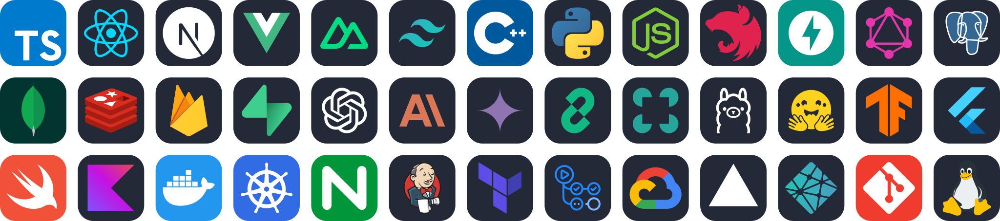

<!--
  GitHub PROFILE README for @RithyBondeth
  Put THIS file + header.svg in a repo named exactly: RithyBondeth/RithyBondeth
  (a repo whose name == your username renders on your profile page).
  The relative ./header.svg path animates because GitHub serves the raw SVG.
-->

  

  
  
  
  
  

---

### 👋 About

Full Stack Developer & AI Engineer based in **Phnom Penh, Cambodia**. I build elegant web
applications and intelligent AI systems — from pixel-perfect UIs to production-ready ML
pipelines. Currently a Software Engineer at the **Digital Economy and Business Committee**
(Ministry of Economy and Finance of Cambodia).

> I believe the best technology is invisible — it just works, and works beautifully.

### 🧰 Tech Stack

  

### 📊 GitHub

  

<em>Building things that just work — beautifully.</em>

